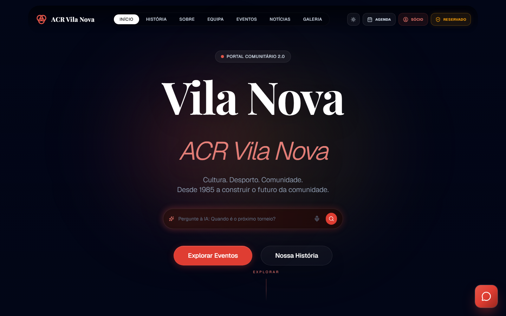
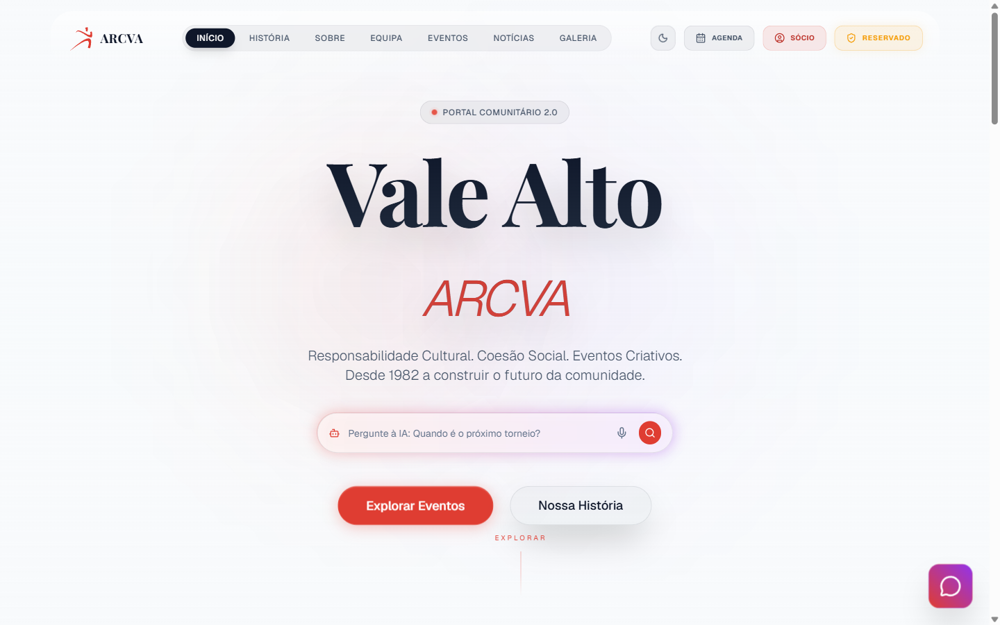
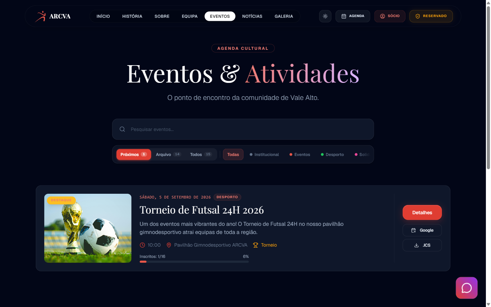
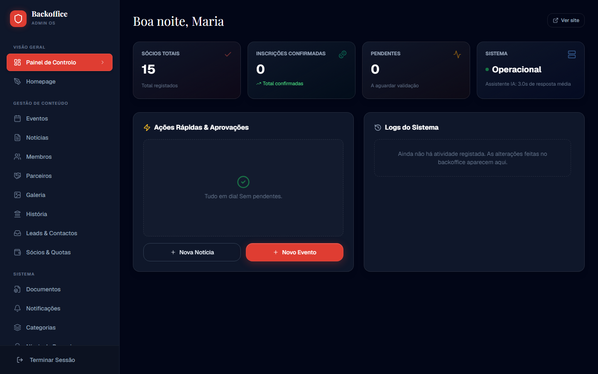
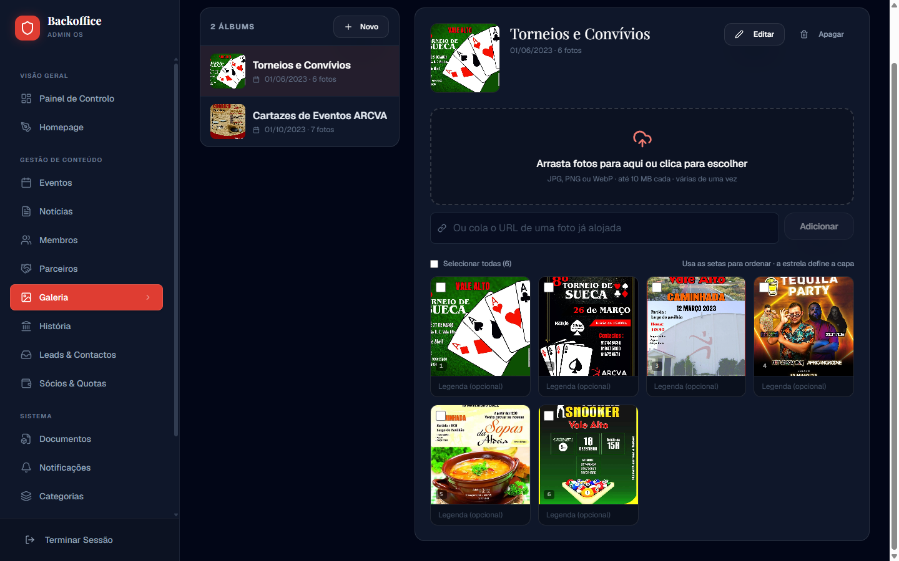

<div align="center">

# Community Platform

### The self-managed digital home for cultural and recreational associations


<a href="https://github.com/brunobola-portfolio/community-platform/actions/workflows/ci.yml"></a>

A white-label community platform: realtime serverless backend, an AI assistant that answers
from the association's own published content (RAG), and a complete backoffice so the board
runs everything — events, news, members, dues, galleries — without a developer.

**Live showcase:** [arcva.pt](https://arcva.pt) — the portal of ARCVA, a Portuguese cultural
association, running this exact codebase.

[Features](#features) · [Getting Started](#getting-started) · [Architecture](#architecture) · [AI Assistant](#ai-assistant) · [White-Label](#launching-your-own-association) · [Deploy](#deploying-to-production)

**English** · [Português](README.pt.md)

</div>

---

### Who should read what

| If you are… | Start here |
| --- | --- |
| Anyone — technical or not | This page, top to bottom (~5 minutes) |
| A developer setting up locally | [Getting Started](#getting-started) → [Commands](#commands) |
| Launching a portal for another association | [White-Label](#launching-your-own-association) → **[docs/WHITE-LABEL.md](docs/WHITE-LABEL.md)** |
| Running instances for clients (private repo + automated deploy) | **[docs/INSTANCE-REPO.md](docs/INSTANCE-REPO.md)** + [templates/instance/](templates/instance/) |
| Releasing or deploying | [Deploy](#deploying-to-production) → **[DEPLOY.md](DEPLOY.md)** (IIS) / **[DEPLOY-VPS.md](DEPLOY-VPS.md)** (nginx) |
| Changing the UI / visual design | **[docs/DESIGN-SYSTEM.md](docs/DESIGN-SYSTEM.md)** |
| An AI coding agent | **[AGENTS.md](AGENTS.md)** (canonical guide) + [CLAUDE.md](CLAUDE.md) |

## Screenshots

Reference instance ([arcva.pt](https://arcva.pt)) — everything below is managed from the admin panel:

| Public portal (dark) | Public portal (light) |
|:---:|:---:|
|  |  |

| Events with filters and registrations | Admin backoffice |
|:---:|:---:|
|  |  |

| Gallery manager: multi-upload, captions, ordering, cover |
|:---:|
|  |

## About

Most small associations depend on a volunteer with technical skills — and stall when that
person leaves. This platform removes the dependency: after the initial deploy, **everything
is managed from the admin panel**. Events with dynamic registration forms, news with a rich
text editor, team pages, photo galleries, member dues, documents, notifications, site
settings, and the AI assistant itself — all database-first, all editable by the board.

**Nothing in this repository names a real association.** The demo seed is a fictitious
club; a real instance lives in three private layers that never reach git — the database
(admin panel), a gitignored `.env.production` for build-time meta tags, and a gitignored
`.brand/` overlay for logos, photos and the OG image. A fresh deployment becomes *your*
association by filling in the admin settings, not by forking the code. See
[docs/WHITE-LABEL.md](docs/WHITE-LABEL.md).

### Born from a real need

The platform started as the new portal of **ARCVA** — a cultural and recreational
association in Portugal — built by [BolaLabs](https://bolalabs.pt) to replace a static
site nobody could update. It grew into a generic product, and ARCVA is its **founding
partner and live reference instance**: every feature here runs in production for a real
community first.

## Features

### Public portal

| Page | Highlights |
|------|-----------|
| **Home** | Animated hero, realtime stats, action areas, news bento grid, events carousel, partners marquee |
| **History** | Editable vertical timeline (admin-managed milestones), historical photo gallery, founding members |
| **About** | AI geo-assistant, interactive map, values pillars, contact form |
| **Team** | Governing bodies by tabs, photos, hierarchy |
| **Events** | Search + filters, calendar export (Google + ICS), registrations with per-event dynamic forms |
| **Blog** | Featured article, category filters with counts, search |
| **Post** | Immersive reading, "Listen to article" TTS, tags, author bio, recommendations |
| **Gallery** | Albums with lightbox, arrow/keyboard navigation |
| **Member area** | 3D digital membership card with QR, dues status, payment instructions (MB WAY/IBAN/Multibanco), private documents, notifications |
| **404** | Styled page with return navigation |

### AI assistant

- **RAG**: injects live portal data (events, team, news, settings) into the model context
- Input classification guardrails: `ASSOCIACAO / LOCAL / GERAL / FORA_DE_TEMA / INJECTION` + regex pre-filter
- Multi-turn history (last 6 messages), clickable navigation links in answers, quick-reply chips
- Portuguese TTS (Gemini TTS); guardrails, persona and models configurable by the admin
- **Identity is dynamic**: the assistant introduces itself with the site name from settings

### Admin panel — 16 management tabs

Dashboard · Homepage · Events (rich text + dynamic registration forms + tournaments) · News ·
Members · Partners · Gallery manager (drag-and-drop multi-upload to Convex storage, captions, ordering, cover pick, bulk delete) · Leads & Contacts (state workflow) · Dues & Members ·
History timeline · Documents · Notifications · Categories · Partnership tiers ·
AI & Chatbot (provider, models, guardrails, analytics) · Settings (full site configuration)

### Media Studio

Image generation (3 Gemini models, 1K–4K), tone-aware text enhancement, TTS narration —
uploads go to Convex storage, never base64.

## Tech Stack

| Layer | Technology | Version |
|-------|-----------|---------|
| Frontend | React + TypeScript | 19.2 + 5.2 |
| Build | Vite (Rolldown) | 8.1 |
| Styling | Tailwind CSS + clsx + tailwind-merge | 3.4 |
| Backend | Convex (serverless, realtime) | 1.31 |
| Auth | @convex-dev/auth (password) | 0.0.90 |
| AI | Google Gemini (@google/genai), multi-provider layer | 1.30 |
| Sanitization | DOMPurify (client) + server-side | 3.3 |

## Architecture

```
Browser (React 19 + Vite)
    │
    ├── React Context (DataContext)    ← global state + Convex→frontend mapping
    ├── Convex Client (WebSocket)      ← realtime sync, reactive queries
    │
    └── Convex Backend (cloud)
         ├── Queries (public)          ← list, getById, getPublic
         ├── Mutations (auth guards)   ← requireAdmin / requireAuth
         ├── Actions (server-side AI)  ← GEMINI_API_KEY never leaves the server
         │    ├── chat (RAG + guardrails + classification)
         │    ├── tts · geoQuery · generateImage · enhanceText
         └── Crons                     ← cleanupRateLimits (hourly), cleanupOldLogs (daily)
```

### Security patterns

- **Auth guards**: `requireAdmin(ctx)` first line of every admin mutation, `requireAuth(ctx)` for user mutations
- **Soft auth**: `isAdmin(ctx)` in queries that return `[]` for non-admins (no throw)
- **Rate limiting**: token bucket per action and per user
- **Sanitization**: server-side + DOMPurify client-side; restrictive CSP in `index.html`
- **Write-only secrets**: provider API keys accepted by `settings.update`, never echoed back (`has*ApiKey` flags)
- **`GEMINI_API_KEY`**: Convex environment variable only — never in code, `.env` files, or the bundle

### Configuration hierarchy

```
Database (admin panel)  →  process.env (server)  →  VITE_* (build)  →  hardcoded defaults
```

AI model defaults have a single source of truth: [convex/lib/aiDefaults.ts](convex/lib/aiDefaults.ts) —
the frontend and the server actions both import from it.

## Getting Started

### Prerequisites

- Node.js ^20.19 or >= 22.12 (Vite 8 requirement), npm >= 9
- A free [Convex](https://convex.dev) account
- A free [Google Gemini API key](https://aistudio.google.com/apikey)

### Quick setup

> Automated alternative: `bash scripts/setup.sh` (Linux/macOS) or
> `powershell -ExecutionPolicy Bypass -File scripts/setup.ps1` (Windows) runs steps 1–3.

```bash
# 1. Clone and install
git clone https://github.com/brunobola-portfolio/community-platform.git
cd community-platform
npm install

# 2. Configure Convex (creates the project and sets VITE_CONVEX_URL)
cp .env.example .env.local
npx convex dev --once

# 3. Gemini API key (server-side only)
npx convex env set GEMINI_API_KEY "AIza..."

# 4. Authentication (generates SITE_URL, JWT_PRIVATE_KEY, JWKS)
npx @convex-dev/auth --web-server-url http://localhost:3000 \
    --skip-git-check --allow-dirty-git-state

# 5. Seed the database with demo data
npx convex run seed:seed

# 6. Run (2 terminals)
npx convex dev          # Terminal 1 — backend
npm run dev             # Terminal 2 — frontend (http://localhost:3000)
```

### Create the admin account

No commands needed. While the database has no admin, every visit redirects to the
**`/setup` wizard**: create email + password (>= 12 characters) and you land in `/admin`.

> Reset (rare): delete the user's `role` field in the Convex Dashboard, or use the CLI
> fallback `npx convex run lib/bootstrapAdmin:setUserRole '{"email":"...","role":"admin"}'`.

## Commands

| Command | Description |
|---------|-------------|
| `npm run dev` | Frontend at http://localhost:3000 (detects a busy port and asks) |
| `npm run dev:kill` | Same, but kills whatever holds the port without asking |
| `npx convex dev` | Convex backend (separate terminal) — regenerates `convex/_generated` |
| `npm run build` | Production build (`tsc && vite build`) |
| `npm run dist` | Build + validation + deploy-ready zip |
| `npm run type-check` | TypeScript check |
| `npm run lint` | ESLint (zero warnings) |
| `npm run preview` | Preview the local build |

There is no test suite; `type-check` + `lint` + `build` are the verification gates.

## AI Assistant

### Multi-provider

Chat, guardrail classification and text enhancement can run on any OpenAI-compatible
provider, configured in **Admin > AI & Chatbot** (keys are write-only — stored server-side,
never returned to the browser):

| Provider | Configuration | Notes |
|----------|--------------|-------|
| `gemini` (default) | `GEMINI_API_KEY` | The only one with grounding (search/maps) |
| `openrouter` | Key + model (e.g. `openai/gpt-4o-mini`) | Hundreds of models |
| `custom` | Base URL + model (e.g. `http://localhost:11434/v1` + `llama3.1`) | Ollama, LM Studio, vLLM |

**TTS, image generation and geo queries always use Gemini**, regardless of the chat provider.

The admin tab includes a **"Testar ligação"** button (round-trip test against the configured
provider, reporting model and latency) and a **live model catalog** for OpenRouter and custom
endpoints, so an operator validates the provider before saving — no CLI needed.

### Default models

All configurable per-instance in Admin > AI & Chatbot; defaults live in
[convex/lib/aiDefaults.ts](convex/lib/aiDefaults.ts):

| Function | Default model | Fallback |
|----------|--------------|----------|
| Chat | `gemini-3-flash-preview` | `gemini-2.5-flash` |
| TTS | `gemini-2.5-flash-preview-tts` | — |
| Image | `gemini-2.5-flash-image` | Unsplash placeholder |

### Rate limits (token bucket)

| Action | Max tokens | Refill/min |
|--------|-----------|------------|
| ai:chat / ai:geoQuery / ai:enhanceText | 10 | 10 |
| ai:tts | 5 | 5 |
| ai:generateImage | 3 | 3 |
| content:create / content:update | 20 / 30 | 10 / 15 |
| registration:create | 5 | 5 |

### Graceful degradation

Without an API key, AI features show unavailability messages; the portal works fully without AI.

## Launching Your Own Association

The short version — full checklist in **[docs/WHITE-LABEL.md](docs/WHITE-LABEL.md)**:

1. Deploy backend + frontend (below) with your own Convex project
2. Open `/setup`, create the admin account
3. Fill in **Admin > Settings**: name, contacts, address, coordinates, socials, dues
4. Replace the static branding: `index.html` meta tags, `public/` logos and OG image,
   brand color in `tailwind.config.ts`
5. Replace the demo content (events, history milestones, team) from the admin panel

## Deploying to Production

Step-by-step guides: **[DEPLOY.md](DEPLOY.md)** (IIS/Windows) and
**[DEPLOY-VPS.md](DEPLOY-VPS.md)** (Linux VPS + nginx).

```bash
# Backend
npx convex deploy
npx convex env set GEMINI_API_KEY "AIza..." --prod
npx @convex-dev/auth --prod --web-server-url https://your-domain.example \
    --skip-git-check --allow-dirty-git-state

# Frontend (validates .env.production, builds, zips)
cp .env.production.example .env.production
npm run dist
```

The output is a static folder — any web server with SPA fallback works. The reference
instance runs on IIS with a <60s rollback path (swap the site's Physical Path back).

## Design System

Full reference in [docs/DESIGN-SYSTEM.md](docs/DESIGN-SYSTEM.md).

| Property | Value |
|----------|-------|
| Theme | Light + dark (`darkMode: 'class'`, dark default), glassmorphism |
| Brand color | `brand-600` #df3d32 (light) / `brand-400`–`brand-500` (dark) |
| Accent | Gold #fbbf24 · Neutrals: slate (dark bg #020617, surface #0f172a) |
| Fonts | Geist (sans), Playfair Display (serif) |
| Radius | `rounded-xl` 12px · `rounded-2xl` 16px · `rounded-3xl` 24px |

## Contributing

See [CONTRIBUTING.md](CONTRIBUTING.md). Highlights: function components only, strict
TypeScript (no `any`), Tailwind exclusively, `requireAdmin(ctx)` first line of admin
mutations, files < 300 lines.

Security reports: see [SECURITY.md](SECURITY.md). Release history: [CHANGELOG.md](CHANGELOG.md).

## Support the project

The platform is free and MIT-licensed. If it saves your association a developer, you can
keep it moving:

[](https://ko-fi.com/brunobola)
[](https://buymeacoffee.com/brunobola)

Consulting, hosting and custom work for associations: [bolalabs.pt](https://bolalabs.pt).

## License

Code is MIT — see [LICENSE](LICENSE).

**Brand assets are not covered by the MIT license.** The repository ships no real
association's name, logo or photographs; the reference instance keeps them in a private
overlay (see [docs/WHITE-LABEL.md](docs/WHITE-LABEL.md)). The ARCVA name and logo belong to
the association. Third-party material used by the platform:

- Demo seed images are hosted on [Unsplash](https://unsplash.com/license) (Unsplash License)
- Typefaces Geist and Playfair Display are served from Google Fonts (SIL Open Font License)
- Icons from [Lucide](https://lucide.dev) (ISC); all npm dependencies are MIT/Apache-2.0/ISC
- Google Gemini and OpenRouter are used under their own terms of service; the platform
  never ships an API key

Contributor guidelines: [CONTRIBUTING.md](CONTRIBUTING.md) · [CODE_OF_CONDUCT.md](CODE_OF_CONDUCT.md).

## Contact

- **Platform / technical**: [bruno@bolalabs.pt](mailto:bruno@bolalabs.pt) · [bolalabs.pt](https://bolalabs.pt)
- **ARCVA (showcase instance)**: [geral@arcva.pt](mailto:geral@arcva.pt) · [arcva.pt](https://arcva.pt)

---

<div align="center">

Built by **[BolaLabs](https://bolalabs.pt)** · Proven in production since 2026 at [arcva.pt](https://arcva.pt)

</div>
